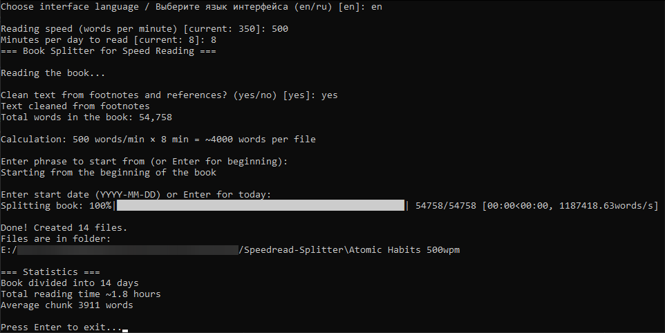

# Book Splitter for Speed Reading


**A simple and powerful tool to split e-books into daily reading portions based on your personal reading speed.**  
Perfect for speed reading practice, building a consistent reading habit, and planning long-term progress.

Fully available in **English** and **Russian**.

## Features

- Supports popular formats: `.fb2`, `.fb2.zip`, `.epub`, `.txt`
- Automatic word counting
- Smart text splitting that respects sentence and paragraph boundaries
- Customizable reading speed (words per minute) and daily reading time
- Option to start from any specific phrase in the book
- Custom start date for generated files (great for scheduling)
- Optional cleanup of footnotes, references, figure/table mentions
- Progress bar for processing large books
- Persistent settings (speed, time, language) saved between runs
- Full interface localization (English / Russian)
- Detailed logging of operations and errors in `splitter.log`

## Screenshots



Console interface in action

## Installation

1. Make sure you have **Python 3.6 or higher** installed
2. Install the required dependencies:

```bash
pip install -r requirements.txt
```

## Usage

1. Download or clone the repository
2. Run the script:

```bash
python main.py
```

3. On first launch, you will be prompted to choose the interface language (en or ru) — the choice is saved permanently
4. Select a book file via the file dialog
5. Enter (or confirm) your parameters:
   - Reading speed (words per minute)
   - Daily reading time (minutes)
   - Starting phrase (optional)
   - Start date for files (optional)
6. The program will create a folder next to the book containing one text file per day

### Example Output

For the book **"Atomic Habits"** with settings:
- 500 words/min
- 5 minutes per day

→ Creates folder `Atomic Habits 500wpm`  
→ Each file contains ~2500 words  
→ File names: `Atomic Habits_2025-12-30_2487-words_500wpm.txt`

## Configuration

Settings are automatically saved to `config.ini` in the same directory as the script.  
A nicely commented file is created on first run with helpful recommendations.

Example `config.ini`:

```ini
# Settings for speed reading

[reading]
# Recommended daily training time (minutes)
# 5-10 minutes is enough to start without overexertion
minutes_per_day = 10

# Target reading speed (words per minute)
# Average speed: 200-300 words/min
# 350-500 is a good goal to start speed reading
words_per_minute = 400

# Interface language. Available: 'en' (English), 'ru' (Russian)
language = en
```

You can edit this file manually — changes will be loaded on the next launch.

## Localization

The program fully supports two languages:

- **English (en)** — default
- **Russian (ru)** — complete translation

## Implementation Details

- Word counting treats hyphenated compounds as single words (e.g., "self-development")
- Splitting algorithm prioritizes natural breaks (paragraphs → sentences)
- File names and console messages adapt to the selected language
- All operations, errors, and statistics are logged to `splitter.log` for easy debugging

## Troubleshooting

If something goes wrong, check `splitter.log` in the script's directory. It contains:
- File reading/writing errors
- Book statistics
- Completion reports

## License

[MIT License](LICENSE) — feel free to use, modify, and distribute.

## Author

Created for anyone who wants to read more consistently and effectively.  
If this tool helped you build a better reading habit — consider giving it a ⭐ on GitHub!